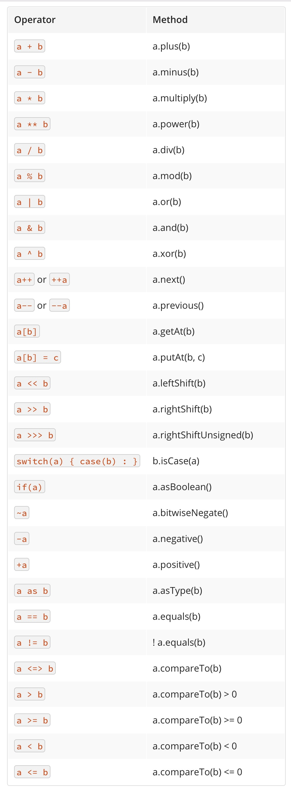

# DSL

## 用delegate属性可以直接实现

```groovy
    public class SMS {
        def from(String a) {
            println("from ${a}")
        }
    
        def to(String a) {
            println("to ${a}")
        }
    
        def body(String a) {
            println("body ${a}")
        }
        def static bodyDSL(String a){
            println "bodyDSL ...${a}"
        }
        def send() {
            println("send ...");
        }
        
        def static send(block) {
            def sms = new SMS();
            block.delegate = sms;
            block()
            sms.send()
        }
    }
    
    SMS.send {
        from "richard"
        to " to richard"
        body "hi richard.g"
    }
    
```

* 另外一个有趣的DSL实例

```groovy

    show = { println it }
    square_root = { Math.sqrt(it) }
    
    def please(action) {
      [the: { what ->
        [of: { n -> action(what(n)) }]
      }]
    }
   
    please show the square_root of 100
    
    
    // ==> 10.0

```


groovy的方法调用是可以不用加"()"的，

上一个例子中

```groovy

 SMS.send {
        from "richard"
        to " to richard"
        body "hi richard.g"
    }
    
```
其实是：

```groovy

 SMS.send({
        from "richard"
        to " to richard"
        body "hi richard.g"
    });
```

又如：

````groovy

class SMS {
    def static bodyDSL(String a){
        println "bodyDSL ...${a}"
    }
}


SMS.bodyDSL "hahahahaahah"

````

## 覆盖操作符. 


        
* groovy可以用重写操作符的英文名方法来实现操作符覆盖




如下实例


````groovy

  class Wizards {
  
      def list = []
  
      def leftShift(person) {
          list.add person
      }
  
      def minus(person) {
          list.remove person
      }
  
      String toString() {
          "${list}"
      }
  }
  
  def wiz = new Wizards();
  
  wiz << 'Gandolf'
  
  println wiz
  
  wiz << 'Harry'
  
  println wiz
  
  wiz - 'Harry'
  
  println wiz;
    
  //如一个普通对象直接用运算符操作的话，它会不可控,或者，报错。而我们可以通过覆盖操作操作符实现可控的结果
    
````

如果是属性操作，也可以用set,get（map-like）风格的，
如：

```groovy

    class myWizards {
        def list = [];
        String toString() {
            "${list}"
        }
        def setAt(it) {
            list.add(it)
        }
    }
    
    def wiz = new myWizards();
    
    wiz['at'] = 'richardgong';
    
    println wiz;
    

```

## 实现methodMissing"魔术"方法，当调用方法一个不存在的方法时，methodMissing方法会被触发

## 实现propertyMissing"魔术"方法，当调用方法一个不存在的属实时，propertyMissing方法会被触发

这种特性，在实现DSL时，特别有用

如：
```groovy

    class A{
        
        def propertyMissing(String name){
            println "i am a propertyMissing method , now you call ${name} missing property"
        }
        def methodMissing(String name, arg){
            println "i am a propertyMissing method , now you call ${name} missing method, arguments is  ${arg}"
        }
    }
    
    def a = new A();
    
    def mp = a.mp;// missing property
    
    def mm = a.mpp('a','b','c');
    
```


